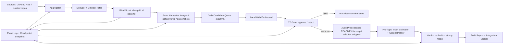

# Project Sentinel v3 Design

Date: 2026-06-14
Last amended: 2026-06-15
Status: Approved for specification review
Owner: TZ

## 1. Objective

Project Sentinel v3, code-named Elite Skill Scout, is a local intelligence system for finding high-leverage skills and tools that can raise the visual and logical quality of deliverables. The target is not generic developer productivity. The target is asset-quality step change: PPTs that avoid low-end template aesthetics, dynamic magazine-like layouts, multimodal document composition, SVG synthesis, and similar capabilities.

The system must minimize token spend by pushing expensive model reasoning to the end of a three-layer funnel:

1. Blind Scout: high-throughput, low-cost filtering.
2. Aesthetic Gatekeeper: TZ reviews visual evidence in a local dashboard.
3. Hard-core Auditor: strong model code and architecture audit only for approved candidates.

## 2. Non-Goals

- Do not build a generic GitHub Trending clone.
- Do not score popularity as the primary signal.
- Do not send raw full READMEs, entire source trees, or unbounded web pages to strong models.
- Do not introduce a database, queue service, cloud backend, or heavyweight install path for v3.
- Do not publish the dashboard to the shared web surface under `/Users/tristanzh/agent/web` in the first implementation.

## 3. Technology Choice

Use TypeScript on Node.js 22+ as the main stack.

First-principles rationale:

- The system is a local automation and file-contract product, not a data-science product. Node has enough built-in HTTP, fetch, filesystem, signal, and AbortController support.
- The dashboard and pipeline can share one type system, reducing JSON contract drift.
- A static local dashboard plus a minimal local HTTP server avoids framework and database overhead.
- `launchd` or `cron` can run a TypeScript-built CLI without persistent services.
- Atomic file writes and JSONL event logs are straightforward and testable.

Python is not the default v3 stack because it would improve scraping convenience while adding a second surface for the local dashboard. The main risk in this product is state, contract, and token-governance correctness, not crawler expressiveness.

## 4. System Topology



## 5. Local File Layout

```text
project-sentinel/
  data/
    events.jsonl
    checkpoint.json
    budget-ledger.json
    blacklist.json
    locks/
    candidates/2026-06-14.json
    decisions/2026-06-14.json
    audits/
    artifacts/
  src/
    cli/
    core/
    scouts/
    dashboard/
    schemas/
    audit/
  tests/
    unit/
    integration/
```

`events.jsonl` is the durable fact log. `checkpoint.json` is a rebuildable snapshot. If they disagree, the event log wins.

All JSON files in `data/` are shared local state. The dashboard, scout CLI, and audit runner must treat them as concurrently readable and writable. No component may mutate JSON files in place.

## 6. Layer 1: Blind Scout

Inputs:

- GitHub Trending-like sources.
- RSS feeds from technical communities.
- Curated repo and author allowlists.
- Repo and owner blacklists.

Responsibilities:

- Fetch metadata with rate-limit-aware retries.
- Deduplicate candidates across sources.
- Apply hard filters before LLM usage.
- Use a low-cost model only for compact intent classification.
- Keep exactly five daily candidates for TZ review.
- Cache visual artifacts when available.

The low-cost classifier must prefer quality-producing tools:

- multimodal layout engines
- advanced document layout
- SVG synthesis
- PPT generation
- PDF or magazine-style composition
- design automation tools with visible high-end output

It must reject:

- generic frontend component libraries
- pure wrappers over commercial AI APIs
- projects without visible output evidence
- marketing-only repos
- unrelated backend tools

## 7. Layer 2: TZ Aesthetic Gatekeeper

Use a local minimal dark dashboard. The first implementation uses static HTML/CSS/JS served by the local Node process.

Layout:

- Left column: five high-purity candidate leads.
- Center column: large artifact theater for screenshots, sample PDFs, or generated previews.
- Right column: value promise, estimated token ROI, confidence, and two actions.

Actions:

- Approve: writes a `GateDecision` with `decision: "approve"` and transitions the candidate to `approved_for_audit`.
- Reject: writes a `GateDecision` with `decision: "reject"`, updates blacklist if requested, and transitions to `rejected_terminal`.

The dashboard must communicate only through local JSON contracts or local HTTP endpoints that perform schema-validated JSON file updates. There is no remote backend.

Dashboard writes to `decisions/*.json`, `blacklist.json`, and state checkpoints must use the Atomic JSON Write protocol in section 12. The dashboard may read without taking a lock, but every read must tolerate the file being replaced between open and parse by retrying the read once before reporting a schema error.

## 8. Layer 3: Hard-core Auditor

The strong model receives only bounded audit packs:

- cleaned README digest
- file tree
- selected source snippets
- artifact index
- TZ approve note
- explicit audit questions

Hard metrics:

- Authenticity: does the tool use robust rendering architecture or prompt-based coordinate guessing?
- Hot-swap friction: can it replace or augment existing local workflows without polluting code or agent routing?
- Boundary robustness: long text, multilingual text, mixed aspect ratios, concurrency, and failure modes.
- Token ROI: does it reduce expensive model usage or merely add another model call?

Strong-audit output must include:

- verdict: `adopt`, `watch`, `reject`, or `sandbox_only`
- confidence
- integration surface
- risk list
- exact evidence paths
- next experiment

## 9. JSON Contracts

### Candidate

```json
{
  "id": "github:owner/repo:2026-06-14",
  "source": {
    "kind": "github",
    "url": "https://github.com/owner/repo",
    "fetched_at": "2026-06-14T08:00:00+08:00"
  },
  "repo": {
    "owner": "owner",
    "name": "repo",
    "stars": 1234,
    "language": "TypeScript",
    "license": "MIT"
  },
  "scout": {
    "category": "multimodal_layout",
    "keep_reason": "Generates editable PPT/document layout assets.",
    "reject_risk": "May be only a prompt wrapper.",
    "estimated_token_roi": 0.42,
    "aesthetic_prior": 0.78,
    "confidence": 0.71
  },
  "artifacts": [
    {
      "kind": "image",
      "source_url": "https://raw.githubusercontent.com/...",
      "local_path": "data/artifacts/owner-repo/sample-1.png",
      "sha256": "..."
    }
  ],
  "state": "awaiting_tz_gate"
}
```

### GateDecision

```json
{
  "candidate_id": "github:owner/repo:2026-06-14",
  "decision": "approve",
  "decided_by": "TZ",
  "decided_at": "2026-06-14T08:10:00+08:00",
  "notes": "Visually restrained and worth source-level audit.",
  "blacklist": null
}
```

Reject example:

```json
{
  "candidate_id": "github:bad/repo:2026-06-14",
  "decision": "reject",
  "decided_by": "TZ",
  "decided_at": "2026-06-14T08:10:00+08:00",
  "notes": "Low-end template look.",
  "blacklist": {
    "repo": "bad/repo",
    "owner": "bad",
    "reason": "Rejected by aesthetic gate."
  }
}
```

### AuditJob

```json
{
  "job_id": "audit:owner/repo:2026-06-14",
  "candidate_id": "github:owner/repo:2026-06-14",
  "model_profile": "o1",
  "input_pack": {
    "readme_digest_path": "data/audits/owner-repo/readme.digest.md",
    "file_tree_path": "data/audits/owner-repo/file-tree.json",
    "selected_snippets_path": "data/audits/owner-repo/snippets.json",
    "artifact_index_path": "data/audits/owner-repo/artifacts.json"
  },
  "budget": {
    "max_input_tokens": 18000,
    "max_output_tokens": 4000,
    "daily_budget_key": "2026-06-14"
  },
  "state": "queued"
}
```

### AuditTokenEstimate

The audit runner must create this local estimate before any third-layer model call. It is a pre-flight input to the budget ledger, not a post-call accounting artifact.

```json
{
  "job_id": "audit:owner/repo:2026-06-14",
  "candidate_id": "github:owner/repo:2026-06-14",
  "model_profile": "o1",
  "tokenizer": "tiktoken-compatible",
  "input_tokens_estimated": 13240,
  "output_tokens_reserved": 4000,
  "total_tokens_reserved": 17240,
  "estimated_at": "2026-06-14T08:20:00+08:00",
  "payload_sha256": "..."
}
```

### AuditReport

```json
{
  "job_id": "audit:owner/repo:2026-06-14",
  "candidate_id": "github:owner/repo:2026-06-14",
  "verdict": "sandbox_only",
  "confidence": 0.74,
  "findings": [
    {
      "metric": "authenticity",
      "score": 0.68,
      "claim": "Uses structured layout primitives, but fallback rendering is weak for long text.",
      "evidence_path": "data/audits/owner-repo/snippets.json"
    }
  ],
  "integration": {
    "surface": "local_cli",
    "hot_swap_friction": 0.35,
    "pollution_risk": "low"
  },
  "next_experiment": "Run the sample renderer on multilingual long-copy slides."
}
```

## 10. State Machine

Legal candidate states:

```text
discovered
-> metadata_fetched
-> cheap_classified
-> assets_cached
-> awaiting_tz_gate
-> rejected_terminal
```

Approve branch:

```text
awaiting_tz_gate
-> approved_for_audit
-> audit_pack_prepared
-> audit_budget_reserved
-> audit_running
-> audit_complete
```

Failure states:

```text
failed_retryable
failed_terminal
```

Only events may move state. The implementation must reject direct state mutation.

## 11. Pre-flight Token Budgeting and Circuit Breaker

Rules:

- Strong model calls require local pre-flight token estimation before budget reservation.
- Token estimation must use a deterministic local tokenizer compatible with the target model family, such as `tiktoken` / `js-tiktoken` for OpenAI-style models or a documented DeepSeek-compatible estimator for DeepSeek-R1.
- The estimator must run against the exact serialized payload that would be sent to the third-layer model.
- If the estimate exceeds `max_input_tokens`, the job fails before any network or model call.
- If the estimate plus reserved output tokens exceeds the remaining daily budget, the job is skipped before any network or model call.
- The budget ledger must record the pre-flight estimate, payload hash, reserved output budget, and reservation id.
- Post-call accounting may reconcile unused reserved budget, but it is not allowed to be the first budget defense.
- Strong model calls require a budget reservation before execution.
- Reservation must be atomic and tied to a `job_id`.
- If the actual token spend is lower than reserved, unused budget is reconciled.
- If the budget is exhausted, the audit is skipped without model invocation.
- Raw or unbounded input is a terminal failure.

Pseudocode:

```ts
async function runStrongAudit(job: AuditJob, ctx: RuntimeContext) {
  const pack = await loadAndValidateAuditPack(job.input_pack);

  if (pack.containsRawReadme || pack.containsUnboundedSource) {
    await failTerminal(job.job_id, "RAW_OR_UNBOUNDED_INPUT_FORBIDDEN");
    return;
  }

  const payload = serializeStrongAuditPayload(pack);
  const payloadHash = sha256(payload);
  const estimated = estimateTokensWithLocalTokenizer({
    model_profile: job.model_profile,
    payload
  });
  const budget = await loadBudgetLedger(job.budget.daily_budget_key);

  if (estimated.input > job.budget.max_input_tokens) {
    await failTerminal(job.job_id, "JOB_INPUT_TOKEN_LIMIT_EXCEEDED");
    return;
  }

  const required = estimated.input + job.budget.max_output_tokens;
  if (budget.remaining < required) {
    await writeEvent({
      type: "audit_skipped_budget_exhausted",
      job_id: job.job_id,
      required,
      remaining: budget.remaining
    });
    return;
  }

  const reservation = await reserveBudgetAtomically({
    key: job.budget.daily_budget_key,
    job_id: job.job_id,
    tokens: required,
    payload_sha256: payloadHash,
    input_tokens_estimated: estimated.input,
    output_tokens_reserved: job.budget.max_output_tokens
  });

  if (!reservation.ok) return;

  try {
    await transition(job.job_id, "audit_budget_reserved");
    const result = await strongModel.audit(pack, {
      max_output_tokens: job.budget.max_output_tokens,
      abort_signal: ctx.abortSignal
    });

    await reconcileBudget(reservation.id, result.actual_tokens);
    await saveAuditResultAtomically(job.job_id, result);
    await transition(job.job_id, "audit_complete");
  } catch (error) {
    await releaseUnusedBudget(reservation.id);
    await markRetryableOrTerminal(job.job_id, error);
  }
}
```

## 12. Atomic JSON Write, Checkpoint, and Graceful Shutdown

Rules:

- Append event first, then write checkpoint snapshot.
- JSON writes use temp file, fsync, operating-system-level atomic replacement, and directory fsync.
- Writers must never overwrite JSON in place.
- Writers must acquire a per-target-file local write lock before read-modify-write sequences to prevent lost updates between the dashboard and scout or audit processes.
- Readers do not take locks. They only read stable target filenames and never read `.tmp` files.
- On startup, rebuild checkpoint from event log if checkpoint is missing or invalid.
- On `SIGINT` or `SIGTERM`, stop accepting new work, abort cancellable network calls, finish safe-point writes, clean temp sandboxes, then exit.

### Atomic JSON Write Protocol

This protocol applies to `checkpoint.json`, `budget-ledger.json`, `blacklist.json`, `candidates/*.json`, `decisions/*.json`, and audit report JSON files.

1. Validate the next JSON object against its schema in memory.
2. Acquire a write lock under `data/locks/` using an atomic lock operation:
   - Node implementation: create a lock directory with `fs.mkdir(lockPath)`.
   - Python helper implementation, if introduced later: create the lock with exclusive file creation or an equivalent atomic primitive.
   - If the lock exists, retry with bounded exponential backoff and jitter.
   - If a lock exceeds the configured stale-lock TTL and the owning PID is absent, mark it stale and recover through a new lock attempt.
3. Read the current target file only after the lock is held for read-modify-write operations.
4. Write the new JSON to a temp file in the same directory as the target, for example `checkpoint.json.<pid>.<nonce>.tmp`.
5. Flush and fsync the temp file.
6. Atomically replace the target path:
   - Node implementation: `fs.rename(tmpPath, targetPath)` on the same filesystem, which maps to POSIX atomic rename semantics.
   - Python helper implementation: `os.replace(tmp_path, target_path)`.
7. Fsync the parent directory.
8. Release the lock.

This guarantees readers observe either the old valid JSON or the new valid JSON. They must never observe partial JSON. The write lock prevents two writers from losing each other's updates; the atomic replace prevents corrupted JSON.

Pseudocode:

```ts
async function applyEvent(event: SentinelEvent) {
  const current = await readCheckpointOrRebuildFromEvents();

  assertLegalTransition(current.state[event.entity_id], event);
  const next = reduce(current, event);

  await appendJsonlAtomically("data/events.jsonl", event);
  await writeJsonAtomically("data/checkpoint.json", next);
}

async function writeJsonAtomically(path: string, value: unknown) {
  validateSchemaForPath(path, value);
  const tmp = `${path}.${process.pid}.${crypto.randomUUID()}.tmp`;
  const bytes = JSON.stringify(value, null, 2);

  await withFileWriteLock(path, async () => {
    await fs.writeFile(tmp, bytes, "utf8");
    await fsyncFile(tmp);
    await fs.rename(tmp, path);
    await fsyncDirectory(dirname(path));
  });
}

async function mutateJsonAtomically(path: string, mutator: (current: unknown) => unknown) {
  await withFileWriteLock(path, async () => {
    const current = await readJsonWithRetry(path);
    const next = mutator(current);
    validateSchemaForPath(path, next);
    const tmp = `${path}.${process.pid}.${crypto.randomUUID()}.tmp`;
    await fs.writeFile(tmp, `${JSON.stringify(next, null, 2)}\n`, "utf8");
    await fsyncFile(tmp);
    await fs.rename(tmp, path);
    await fsyncDirectory(dirname(path));
  });
}

function installGracefulShutdown(ctx: RuntimeContext) {
  let shuttingDown = false;

  async function shutdown(signal: "SIGINT" | "SIGTERM") {
    if (shuttingDown) return;
    shuttingDown = true;

    ctx.abortController.abort();

    await applyEvent({
      type: "shutdown_requested",
      signal,
      at: nowIso()
    });

    await ctx.currentIoBarrier.waitUntilSafePoint();
    await cleanupTempSandboxes();
    process.exit(0);
  }

  process.on("SIGINT", () => void shutdown("SIGINT"));
  process.on("SIGTERM", () => void shutdown("SIGTERM"));
}
```

## 13. Resilience and Rate Limits

All source fetchers and model clients must use:

- exponential backoff with jitter
- bounded retry count
- per-source checkpoint cursor
- idempotency key per fetch or audit job
- terminal failure for schema-invalid data

Retryable failures:

- HTTP 429
- HTTP 5xx
- network timeout
- local temporary file collision

Terminal failures:

- invalid source schema
- forbidden raw strong-model input
- unsupported artifact type
- illegal state transition

## 14. Test Contract for First Implementation

The first implementation plan must start from tests for:

1. Budget is exhausted, so no strong model request is made.
2. Audit pack contains raw README content, so the job fails terminally.
3. Process restarts after `assets_cached`, and no candidate is fetched twice.
4. A partial checkpoint write is ignored and rebuilt from `events.jsonl`.
5. `SIGTERM` during network fetch writes a shutdown event and leaves valid JSON.
6. Rejected repo or owner is filtered from future daily queues.
7. Daily queue produces exactly five candidates when five or more valid candidates exist.
8. Dashboard approve and reject actions write schema-valid decisions.

### Offline TDD Matrix

All tests in the first implementation must run without connecting to the public internet and without calling real model APIs. External boundaries must be replaced by mocks or local fixture servers.

| Requirement | Offline test method | Required assertion |
| --- | --- | --- |
| Atomic JSON write prevents corruption | Run two concurrent writers against the same decision or blacklist JSON using temporary directories and mocked delays around lock acquisition. In the TypeScript stack use Vitest fake timers / `vi.fn`; if a Python helper is later introduced, use `pytest-mock` to patch filesystem timing. | The final file parses as valid JSON every time, contains no partial content, and no `.tmp` file is treated as authoritative. |
| Atomic write prevents lost dashboard/scout updates | Simulate dashboard reject and scout checkpoint update attempting read-modify-write on the same file. | Both updates are present after serialized lock-protected writes, or one fails retryably without corrupting the target. |
| Pre-flight token budgeting blocks oversized payloads | Mock the local tokenizer to return an input estimate above `max_input_tokens`. | Strong model client mock is not called, event log records `JOB_INPUT_TOKEN_LIMIT_EXCEEDED`, and no budget reservation is created. |
| Pre-flight daily budget blocks expensive audits | Mock tokenizer estimate plus reserved output tokens above remaining daily budget. | Strong model client mock is not called, event log records `audit_skipped_budget_exhausted`, and the job remains resumable. |
| HTTP 429 rate limit handling | Mock `fetch` / source client to return HTTP 429 for the first attempts, then success. In TypeScript use injected clients and Vitest mocks; for future Python collectors use `pytest-mock` to patch the HTTP client response. | Retry count, exponential backoff, checkpoint cursor, and final success state are deterministic under fake timers. |
| Network failure during source fetch | Mock timeout or connection reset before metadata write. | State moves to `failed_retryable`, checkpoint remains valid, and rerun does not duplicate already completed work. |
| `SIGTERM` during I/O | Spawn the CLI as a child process or call the signal handler through an injected runtime context; mock a long-running write or fetch. | Shutdown event is appended, AbortController is triggered, temp sandbox cleanup runs, and every JSON file still parses. |
| `SIGINT` during audit reservation | Mock signal after budget reservation but before model call. | Unused reservation is released or marked resumable, strong model client is not called unless reservation and pre-flight checks completed. |
| Checkpoint rebuild after partial snapshot | Write a corrupt `checkpoint.json` while leaving valid `events.jsonl`. | Startup rebuilds checkpoint from events and ignores the corrupt snapshot. |
| Blacklist suppression | Use local fixture candidates and a local blacklist JSON. | Rejected repo or owner never appears in the next five-candidate queue. |

## 15. Approval Gate

This SDD is approved only for review and implementation planning. Business implementation must not start until the implementation plan and tests are defined.
