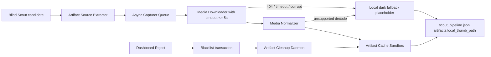

# Project Sentinel v3 Automated Artifact Capturer Design

Date: 2026-06-16
Status: Draft for red-line specification review
Owner: TZ
Parent SDD: `/Users/tristanzh/agent/docs/superpowers/specs/2026-06-14-project-sentinel-v3-design.md`
Implementation root: `/Users/tristanzh/agent/Git-Scout`

## 1. Objective

Automated Artifact Capturer is the incremental module that upgrades Project Sentinel v3 from dummy visual samples to real project artifacts. Its job is to extract, download, normalize, and cache high-value visual evidence from candidate repos so Agent07 can show real PPT, magazine, SVG, PDF, or video-frame previews without blocking the Blind Scout pipeline.

The module exists for one reason: TZ's aesthetic gate needs real visual evidence. It must not turn the local machine into an uncontrolled media downloader.

## 2. Non-Goals

- Do not build a general-purpose web crawler.
- Do not download full repositories for artifact extraction.
- Do not block Blind Scout candidate ranking while media is downloaded.
- Do not trust remote image dimensions, MIME type, content length, or file extension without validation.
- Do not let remote 404, corrupt PDF, broken video, or unsupported MIME types render as broken image icons on Agent07.
- Do not keep artifacts for rejected repos.
- Do not introduce a cloud object store, database, Redis queue, or browser automation dependency for v3 Capturer.

## 3. System Placement

Capturer sits between Blind Scout candidate selection and Agent07 rendering.



The dashboard must remain usable even if Capturer has never run. Every candidate must always have a valid `artifacts.local_thumb_path`, either to a captured local asset or to the local fallback placeholder.

## 4. Local Storage Layout

Capturer owns only this sandbox:

```text
/Users/tristanzh/agent/Git-Scout/storage/artifacts/
  _fallback/
    dark-placeholder.svg
  _manifests/
    github_designer-ai_vector-ppt-engine.json
  github_designer-ai_vector-ppt-engine/
    20260616T083000Z_0_img_a63d4e2b.png
    20260616T083000Z_1_pdf_91bb0d77.png
```

Rules:

- No Capturer output may be written outside `/Users/tristanzh/agent/Git-Scout/storage/artifacts/`.
- The existing demo path `/Users/tristanzh/agent/Git-Scout/artifacts/demo/` remains a development fixture only.
- The fallback asset is committed or generated locally and is never fetched from the network.
- Manifests are JSON files written with the same Atomic JSON Write protocol as Sentinel state files.

## 5. Cache Naming and Path Mapping

### Repo Directory Name

Repo identity is normalized as:

```text
repo_cache_key = lower(repo).replace(/[^a-z0-9._-]+/g, "_")
```

Examples:

```text
github/designer-ai/vector-ppt-engine -> github_designer-ai_vector-ppt-engine
owner/repo.with.dot -> owner_repo.with.dot
```

### File Name

Each cached artifact filename must be deterministic for a given source URL and extraction type:

```text
<captured_at_utc_compact>_<source_index>_<kind>_<sha256_8>.<normalized_ext>
```

Fields:

- `captured_at_utc_compact`: UTC timestamp such as `20260616T083000Z`.
- `source_index`: order in the extracted source list after dedupe.
- `kind`: `img`, `pdf`, `video_frame`, or `fallback`.
- `sha256_8`: first 8 hex chars of `sha256(repo + "\n" + source_url + "\n" + kind)`.
- `normalized_ext`: `png`, `jpg`, `webp`, or `svg`. PDF and video inputs must map to preview images, not raw heavy media, for dashboard thumbnails.

### JSON Mapping

The canonical Agent07 candidate shape remains compatible with current `scout_pipeline.json`, but `artifacts` expands from a single path into a structured contract. During compatibility mode, `artifacts.local_thumb_path` stays required.

```json
{
  "artifacts": {
    "local_thumb_path": "/agent07-artifacts/storage/github_designer-ai_vector-ppt-engine/20260616T083000Z_0_img_a63d4e2b.png",
    "status": "CAPTURED",
    "primary_kind": "image",
    "items": [
      {
        "kind": "image",
        "source_url": "https://raw.githubusercontent.com/owner/repo/main/docs/sample.png",
        "local_path": "storage/artifacts/github_designer-ai_vector-ppt-engine/20260616T083000Z_0_img_a63d4e2b.png",
        "served_path": "/agent07-artifacts/storage/github_designer-ai_vector-ppt-engine/20260616T083000Z_0_img_a63d4e2b.png",
        "sha256": "a63d4e2b...",
        "bytes": 184221,
        "captured_at": "2026-06-16T08:30:00Z",
        "source_confidence": 0.84
      }
    ],
    "errors": []
  }
}
```

Allowed `artifacts.status` values:

```text
PENDING
CAPTURING
CAPTURED
FALLBACK_USED
CLEANUP_PENDING
CLEANED
FAILED_TERMINAL
```

`local_thumb_path` must always point to a route the local Web server can serve. For Agent07, the intended served prefix is:

```text
/agent07-artifacts/storage/<repo_cache_key>/<filename>
```

The local server must map that route to:

```text
/Users/tristanzh/agent/Git-Scout/storage/artifacts/<repo_cache_key>/<filename>
```

## 6. Source Extraction Rules

Capturer receives bounded candidate metadata from Blind Scout. It never receives an unbounded full repo.

Allowed input fields:

```json
{
  "repo": "github/designer-ai/vector-ppt-engine",
  "readme_markdown": "bounded README digest or raw README capped by Blind Scout",
  "homepage_url": "https://github.com/designer-ai/vector-ppt-engine",
  "source_urls": []
}
```

### Markdown Images

The extractor must support:

```markdown


```

Rules:

- Resolve relative README paths against the repo default branch raw URL only after the source client has provided the repo metadata.
- Deduplicate by normalized absolute URL.
- Reject `data:` URLs, inline base64, `file:` URLs, private LAN URLs, and URLs with unsupported protocols.
- Prefer images whose alt text, path, or surrounding text contains: `demo`, `sample`, `screenshot`, `preview`, `ppt`, `slide`, `layout`, `pdf`, `magazine`, `artifact`.
- Limit extracted media source candidates per repo to `max_source_candidates_per_repo = 8`.

### PDF Sample Links

The extractor must support Markdown and HTML links ending in `.pdf` or with content-type `application/pdf`.

Rules:

- Do not serve raw PDFs as dashboard thumbnails.
- Download PDF only if `Content-Length <= max_pdf_bytes`.
- Render only the first page preview in implementation environments that have a safe local renderer.
- If a renderer is unavailable or decode fails, use fallback placeholder.
- Store PDF preview as PNG or SVG, not as raw PDF in `local_thumb_path`.

### Video Frame Links

The extractor may support short video previews in a later implementation stage.

Rules for v3 design:

- Video is optional.
- If implemented, capture exactly one still frame at `t = min(1s, duration * 0.1)`.
- Reject videos above `max_video_bytes`.
- If local frame extraction tooling is unavailable, record `VIDEO_UNSUPPORTED` and use fallback.
- Never auto-play video inside Agent07.

## 7. Async Queue and Concurrency Ceiling

Capturer must not block Blind Scout's core selection. Blind Scout writes candidate state with `artifacts.status = "PENDING"` and an immediate fallback `local_thumb_path`. Capturer then processes jobs asynchronously.

Queue design:

```text
ArtifactCaptureJob
  job_id
  repo
  candidate_id
  source_urls[]
  priority
  created_at
  attempts
  idempotency_key
```

Hard limits:

| Limit | Required value for v3 |
| --- | --- |
| `max_concurrent_repos` | 2 |
| `max_concurrent_downloads_per_repo` | 3 |
| `download_timeout_ms` | 5000 |
| `max_source_candidates_per_repo` | 8 |
| `max_artifacts_kept_per_repo` | 5 |
| `max_image_bytes` | 5 MB |
| `max_pdf_bytes` | 12 MB |
| `max_video_bytes` | 25 MB |
| `max_repo_artifact_bytes` | 20 MB |
| `max_total_artifact_bytes` | 1 GB |
| `artifact_ttl_days` | 14 |

Implementation must use an injected scheduler or queue interface so tests can run without real timers or network calls.

No Capturer worker may call a model API. Capturer is deterministic I/O plus local media normalization only.

## 8. Download Validation

Every remote fetch must be defensive:

1. Pre-check URL protocol and host.
2. Use `AbortController` with `download_timeout_ms <= 5000`.
3. If `Content-Length` exceeds limit, abort before reading body.
4. Read stream with cumulative byte counter. Abort if byte ceiling is crossed even if `Content-Length` is absent or false.
5. Validate MIME type and magic bytes.
6. Normalize to dashboard-safe preview format.
7. Write output with temp-file plus atomic rename.
8. Update manifest with either captured asset or fallback path.

Retry rules:

- HTTP 404: terminal for that source URL, no retry.
- HTTP 429: retry with exponential backoff and jitter, bounded by `max_attempts = 3`.
- HTTP 5xx: retry with bounded backoff.
- Decode failure: terminal for that source URL, fallback used.
- Disk quota exceeded: terminal for that repo until cleanup frees space.

## 9. Fallback Placeholder Protocol

Fallback is not a visual afterthought. It is part of the UI stability contract.

Required fallback path:

```text
/Users/tristanzh/agent/Git-Scout/storage/artifacts/_fallback/dark-placeholder.svg
```

Required served path:

```text
/agent07-artifacts/storage/_fallback/dark-placeholder.svg
```

Fallback rules:

- Before any network fetch begins, candidate `local_thumb_path` must point to fallback.
- If all source candidates fail, set `artifacts.status = "FALLBACK_USED"`.
- If at least one source succeeds, set `local_thumb_path` to the best local preview and preserve failed source errors in `artifacts.errors`.
- The dashboard must never render remote URLs directly.
- The dashboard must never render a missing path if fallback exists.

Fallback error shape:

```json
{
  "code": "REMOTE_404",
  "source_url": "https://example.com/missing.png",
  "message": "Remote artifact returned 404",
  "at": "2026-06-16T08:32:00Z"
}
```

Allowed error codes:

```text
REMOTE_404
REMOTE_429_EXHAUSTED
REMOTE_TIMEOUT
CONTENT_LENGTH_EXCEEDED
BYTE_LIMIT_EXCEEDED
UNSUPPORTED_MIME
DECODE_FAILED
VIDEO_UNSUPPORTED
PDF_RENDERER_UNAVAILABLE
DISK_QUOTA_EXCEEDED
UNKNOWN_CAPTURE_ERROR
```

## 10. Storage Sandbox, TTL, and Quota

Capturer must maintain a manifest per repo:

```json
{
  "version": 1,
  "repo": "github/designer-ai/vector-ppt-engine",
  "repo_cache_key": "github_designer-ai_vector-ppt-engine",
  "created_at": "2026-06-16T08:30:00Z",
  "updated_at": "2026-06-16T08:32:00Z",
  "bytes_total": 184221,
  "ttl_expires_at": "2026-06-30T08:30:00Z",
  "items": []
}
```

Quota rules:

- Before writing an artifact, calculate projected repo bytes and total bytes.
- If projected repo bytes exceed `max_repo_artifact_bytes`, skip the write and use fallback or already captured smaller artifact.
- If projected total bytes exceed `max_total_artifact_bytes`, run TTL cleanup before the write.
- If cleanup cannot free enough space, mark capture as `DISK_QUOTA_EXCEEDED`.
- Raw PDF and video inputs may be kept only in temporary decode directories and must be deleted after preview generation.

TTL cleanup:

- Runs at Capturer startup.
- Runs after each successful capture batch.
- Deletes repo artifact directories whose manifest `ttl_expires_at < now`.
- Never deletes `_fallback`.
- Never deletes a repo currently in `CAPTURING` state.

## 11. Reject and Blacklist Cleanup Contract

When TZ clicks Reject in Agent07, no future UI state may retain artifact references for that repo.

Physical deletion timing has a platform constraint: no filesystem can guarantee sub-microsecond physical removal. The enforceable contract is:

1. In the same reject transaction, remove the lead from `scout_pipeline.json`.
2. Append repo or author to blacklist.
3. Remove all artifact path references for that repo from active state.
4. Invoke physical cleanup of `/storage/artifacts/<repo_cache_key>/` before the Reject API returns when the directory is locally accessible.
5. If physical cleanup fails due to transient filesystem state, write `CLEANUP_PENDING` with the exact path and retry through the cleanup daemon. The dashboard must still stop serving or referencing those files immediately.

Reject cleanup event:

```json
{
  "type": "artifact_cleanup_requested",
  "repo": "github/cheap-templates/bad-ppt",
  "repo_cache_key": "github_cheap-templates_bad-ppt",
  "reason": "dashboard_reject",
  "requested_at": "2026-06-16T08:40:00Z"
}
```

Cleanup daemon requirements:

- Use recursive deletion only inside `/Users/tristanzh/agent/Git-Scout/storage/artifacts/`.
- Refuse to delete paths that resolve outside the artifact sandbox.
- Retry `CLEANUP_PENDING` jobs with bounded backoff.
- After successful deletion, mark the repo manifest as removed or delete the manifest atomically.

## 12. State Transitions

Artifact-specific state is nested under each lead. Legal transitions:

```text
PENDING
-> CAPTURING
-> CAPTURED
```

Failure path:

```text
PENDING
-> CAPTURING
-> FALLBACK_USED
```

Cleanup path:

```text
CAPTURED
-> CLEANUP_PENDING
-> CLEANED
```

Terminal failure path:

```text
CAPTURING
-> FAILED_TERMINAL
```

Rules:

- `CAPTURED` requires at least one validated local artifact item.
- `FALLBACK_USED` requires a valid fallback local path.
- `FAILED_TERMINAL` must still set `local_thumb_path` to fallback.
- `CLEANED` means no active lead references the repo's local artifact path.
- State writes use the existing `.lock + temp JSON + atomic rename` protocol.

## 13. Integration with Agent07

Agent07 must continue to read `artifacts.local_thumb_path`.

Minimal UI-facing contract:

```json
{
  "artifacts": {
    "local_thumb_path": "/agent07-artifacts/storage/_fallback/dark-placeholder.svg",
    "status": "FALLBACK_USED",
    "primary_kind": "fallback",
    "errors": [
      {
        "code": "REMOTE_TIMEOUT",
        "source_url": "https://example.com/demo.png",
        "message": "Download exceeded 5000ms"
      }
    ]
  }
}
```

Dashboard behavior:

- If `status = "CAPTURING"`, render fallback or last successful artifact with a subtle status label.
- If `status = "FALLBACK_USED"`, render fallback without broken-image icon.
- If `errors` exists, dashboard may show a compact diagnostic in the right column later, but not in this SDD's first implementation.

## 14. Security and Privacy Boundaries

- Do not fetch private GitHub resources without explicit credentials and a separate SDD.
- Do not store cookies, auth headers, tokens, or signed URLs in manifests.
- Strip query parameters from display strings where they may include secrets, but keep hashed source identity for dedupe.
- Do not execute downloaded media.
- Do not shell out to decoders unless input paths are inside a temporary sandbox and output paths are inside the artifact sandbox.
- Do not follow redirects to private IP ranges or localhost.
- Preserve source URLs and capture errors for reproducibility, but never expose credentials.

## 15. TDD Acceptance Matrix for Next Phase

The next implementation phase must start with tests. No Capturer business code should be written until these tests are Red.

| Requirement | Offline test method | Required assertion |
| --- | --- | --- |
| Markdown image extraction | Feed fixture README with Markdown image, HTML image, relative path, and duplicate image URL. | Extractor returns deduped absolute URLs, capped at 8, ordered by visual relevance. |
| Local path naming | Pass repo and source URLs through naming function. | Generated path is deterministic, sandboxed under `storage/artifacts/<repo_cache_key>/`, and includes sha256 prefix. |
| Async non-blocking queue | Inject fake queue and fake timers. | Blind Scout can write PENDING candidates immediately while capture job remains queued. |
| Per-repo concurrency | Run 10 fake downloads through injected scheduler. | At most 3 downloads for one repo run concurrently. |
| Download timeout | Mock downloader that never resolves. | Abort occurs at or before 5000ms and fallback path is selected. |
| HTTP 404 fallback | Mock fetch returning 404 for all sources. | `artifacts.status = "FALLBACK_USED"` and `local_thumb_path` equals fallback served path. |
| Byte ceiling | Mock missing `Content-Length` but stream emits more than `max_image_bytes`. | Download aborts and no oversized file remains in artifact directory. |
| PDF decode failure | Mock PDF source and decoder failure. | Raw PDF temp file is deleted and fallback is used. |
| Video unsupported | Mock video URL with video disabled. | Error code is `VIDEO_UNSUPPORTED`; no raw video remains. |
| Repo quota | Seed repo manifest near quota and attempt another artifact. | Capture is skipped or fallback used; repo bytes do not exceed quota. |
| TTL cleanup | Seed expired and non-expired manifests. | Expired repo directory is deleted; fallback directory remains. |
| Reject cleanup | Seed captured artifacts and call dashboard reject cleanup adapter. | Active state removes lead, blacklist is updated, repo artifact directory is deleted or marked `CLEANUP_PENDING`; no UI path points to deleted repo files. |
| Broken local file path | Delete captured file before dashboard render. | Dashboard receives fallback path instead of broken image path. |
| Atomic manifest write | Interrupt manifest write after temp file creation. | Manifest target remains valid JSON and temp file is not authoritative. |

## 16. Implementation Boundary

This SDD authorizes only design review. The next step must be a TDD Red commit that creates Capturer tests and interface stubs under `/Users/tristanzh/agent/Git-Scout`.

No network downloader, decoder integration, dashboard mutation, or cleanup daemon business logic may be implemented before those tests exist and fail for the expected reason.
