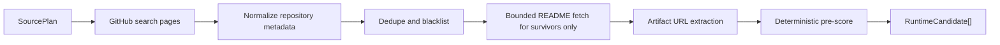

# Project Sentinel v3 Real Public Source Adapter SDD

Date: 2026-06-16
Status: Draft for red-line specification review
Owner: TZ
Baseline commit: `9e6c56f`
Parent SDD:
- `/Users/tristanzh/agent/docs/superpowers/specs/2026-06-14-project-sentinel-v3-design.md`
- `/Users/tristanzh/agent/docs/superpowers/specs/2026-06-16-project-sentinel-v3-runtime-orchestrator-sdd.md`
- `/Users/tristanzh/agent/docs/superpowers/specs/2026-06-16-project-sentinel-v3-runtime-orchestrator-implementation-plan.md`
Implementation root: `/Users/tristanzh/agent/Git-Scout`

## 1. Objective

The Real Public Source Adapter is the next Sentinel v3 increment after the Production Runtime Orchestrator. Its job is to replace the current mock source branch with real, bounded public discovery inputs while preserving every Stage 6 safety gate:

```text
npm run sentinel:daily
  -> Runtime gates
  -> Real public source adapters only when --live-network=true
  -> deterministic source normalization
  -> bounded README/artifact hint fetch
  -> Blind Scout Top-5 funnel
  -> runtime_shadow two-phase publish
```

The adapter must discover public repositories and public technical feeds that may contain high-value presentation, document layout, SVG/PDF generation, multimodal asset, or agent productivity tools. It must not become a generic crawler.

## 2. Source Facts and External API Constraints

This design treats GitHub official documentation as the authoritative contract for GitHub network behavior.

- GitHub REST API rate limits apply to all public data fetches. Unauthenticated public REST requests are limited to 60 requests per hour, while authenticated user requests count against a higher personal bucket. Search endpoints have a stricter custom rate limit: 30 requests per minute when authenticated and 10 requests per minute when unauthenticated.
- GitHub rate-limit handling must honor `x-ratelimit-remaining`, `x-ratelimit-reset`, and `retry-after` when present. GitHub documents both primary and secondary rate limits, and warns that continuing while rate-limited may get an integration banned.
- GitHub Search API provides at most 1,000 results per search and repository search supports `sort=stars|forks|help-wanted-issues|updated`, `order`, `per_page`, and `page`.
- Repository content and README fetches must use GitHub Contents/README APIs instead of `git clone`. The Contents API exposes raw/object media types and size boundaries. Files greater than 100 MB are unsupported by the endpoint, and larger files require raw/object behavior.
- There is no official GitHub Trending REST API in the GitHub REST API documentation. Therefore, "trending-like" discovery must be a bounded approximation using Search API windows, curated feeds, and explicit query packs. HTML Trending scraping is a disabled fallback, not a production default.

References:
- GitHub REST rate limits: https://docs.github.com/en/rest/using-the-rest-api/rate-limits-for-the-rest-api
- GitHub REST search endpoints: https://docs.github.com/en/rest/search/search
- GitHub repository contents endpoints: https://docs.github.com/en/rest/repos/contents

## 3. Non-Goals

- Do not scrape GitHub Trending HTML by default.
- Do not call any real network path unless Runtime has `gates.live_network === true`.
- Do not call any real model path from the source adapter.
- Do not fetch full repositories or execute repository code.
- Do not fetch arbitrary source code files for Tier-3 audit. The Hardcore Auditor remains responsible for code-level inspection after TZ approval.
- Do not write directly to `/Users/tristanzh/agent/Git-Scout/data/scout_pipeline.json`.
- Do not use `tests/fixtures/` in production runtime.
- Do not store API keys, tokens, cookies, or private feed credentials in source files or logs.
- Do not treat star count as the primary value signal.

## 4. Design Alternatives

### Option A: Official REST Search API as Primary Adapter

Use GitHub Repository Search with deterministic query packs, narrow date windows, topic/keyword filters, and bounded pagination. Fetch README only after deterministic filtering.

Pros:
- Official, documented, rate-limit-aware.
- Stable JSON contract.
- Easy to mock in TDD.
- Fits Runtime gate and checkpoint model.

Cons:
- Not a true GitHub Trending replacement.
- Search ranking is opaque and can return incomplete results.

### Option B: GitHub Trending HTML Scraper

Scrape `github.com/trending` HTML and parse repository cards.

Pros:
- Closest visual match to the public Trending page.

Cons:
- Not an official API contract.
- Fragile against HTML changes.
- Harder to test deterministically.
- Higher risk of accidental ToS or bot-detection friction.

### Option C: Curated Feed Aggregator

Use a hand-maintained source list: GitHub release feeds, repository activity feeds, Hacker News RSS, engineering blog RSS, and known layout/document/PPT tool authors.

Pros:
- High signal and cheap.
- Excellent for long-term "known expert" monitoring.

Cons:
- Lower discovery breadth.
- Requires curated list maintenance.

### Decision

Implement Option A first, with Option C as the second adapter family. Option B remains explicitly disabled until a future SDD justifies and tests it. The first production adapter should be boring, official, bounded, and easy to replay.

## 5. Runtime Integration Boundary

The adapter plugs into the Stage 6 Runtime Orchestrator through the existing source-client seam:

```ts
type RuntimeSourceClient = {
  fetchCandidates: () => Promise<RuntimeCandidate[]>;
};
```

The real source adapter must not infer mode from environment or cwd. Runtime creates it with an immutable config:

```ts
type RealSourceAdapterConfig = {
  version: 1;
  runtime: Pick<RuntimeConfig, "date" | "run_id" | "gates" | "paths" | "limits">;
  source_plan: SourcePlan;
  github: {
    token_env: "GITHUB_TOKEN";
    api_version: "2026-03-10";
    user_agent: "project-sentinel-v3-local";
    request_timeout_ms: 8000;
    max_concurrency: 2;
    max_pages_per_query: 2;
    per_page: 50;
    max_readme_bytes: 30000;
    max_readme_digest_chars: 10000;
  };
};
```

Gate rules:

| Runtime gate | Adapter behavior |
| --- | --- |
| `live_network=false` | Do not instantiate real GitHub/RSS clients. Return fixture/cached mock only or throw `LIVE_NETWORK_DISABLED` if explicitly requested. |
| `live_network=true` | Permit real public source adapters within request, pagination, and rate-limit ceilings. |
| `live_model=false` | Still permitted. Adapter returns deterministic metadata and bounded README digest only. No LLM classification. |
| `live_publish=false` | Adapter writes only under `storage/runtime_shadow/<run_id>/sources/`. |
| `dry_run=true` | Same as no publish; network still forbidden unless `--live-network=true` is explicitly present and dry-run live collection is intentionally requested. |

## 6. Source Plan

The runtime receives a source plan, not free-form crawl instructions.

```ts
type SourcePlan = {
  version: 1;
  date: string;
  max_candidates_before_blind_scout: number;
  github_search_queries: GitHubRepositorySearchQuery[];
  rss_feeds: RssFeedSource[];
  disabled_sources: DisabledSource[];
};

type GitHubRepositorySearchQuery = {
  id: string;
  description: string;
  q: string;
  sort: "updated" | "stars" | "forks" | "help-wanted-issues";
  order: "desc" | "asc";
  page_start: 1;
  page_limit: number;
  per_page: number;
  enabled: boolean;
};

type RssFeedSource = {
  id: string;
  url: string;
  source_kind: "github_releases" | "github_commits" | "hacker_news" | "engineering_blog";
  enabled: boolean;
  max_items: number;
};

type DisabledSource = {
  id: string;
  source_kind: "github_trending_html";
  reason: "NO_OFFICIAL_API_CONTRACT" | "HTML_DRIFT_RISK" | "RATE_LIMIT_RISK";
};
```

Initial GitHub query packs should stay short enough to respect GitHub's query limitations and focused enough to avoid broad corpus scans:

```text
("presentation" OR "pptx" OR "slide") layout pushed:>=YYYY-MM-DD
("pdf" OR "document") ("layout" OR "typesetting") pushed:>=YYYY-MM-DD
("svg" OR "canvas") ("diagram" OR "poster" OR "infographic") pushed:>=YYYY-MM-DD
("multimodal" OR "agent") ("artifact" OR "report") pushed:>=YYYY-MM-DD
topic:pptx topic:automation pushed:>=YYYY-MM-DD
```

The implementation phase may split queries further to stay under GitHub query length and boolean-operator limits. Query construction must be deterministic and testable.

## 7. Normalized Candidate Contract

The source adapter must normalize every raw item before returning it to Blind Scout.

```ts
type SourceCandidateEnvelope = {
  version: 1;
  source_id: string;
  source_kind: "github_repository_search" | "rss_feed" | "cached_snapshot";
  fetched_at: string;
  raw_source_ref: {
    api_url?: string;
    page?: number;
    etag?: string;
    rate_limit_remaining?: number;
    rate_limit_reset_epoch?: number;
  };
  dedupe_key: string;
  repo: {
    full_name: string;
    owner: string;
    name: string;
    html_url: string;
    private: false;
    default_branch?: string;
    pushed_at?: string;
    created_at?: string;
    updated_at?: string;
    stars?: number;
    forks?: number;
    topics: string[];
    license_spdx_id?: string | null;
  };
  content: {
    title: string;
    description: string;
    readme_digest: string;
    readme_truncated: boolean;
    artifact_url_candidates: string[];
  };
  scoring: {
    deterministic_score: number;
    matched_keywords: string[];
    artifact_hint_count: number;
    freshness_score: number;
    source_confidence: "HIGH" | "MEDIUM" | "LOW";
  };
  safety: {
    blacklisted: boolean;
    blocked_reason?: string;
    network_calls_used: number;
    token_cost: 0;
  };
};
```

Conversion to existing `RuntimeCandidate` is a lossy final step:

```ts
type RuntimeCandidate = {
  id: string;              // dedupe_key
  repo: string;            // owner/name
  title: string;           // normalized title
  category: string;        // deterministic category before Blind Scout
  readme: string;          // bounded readme_digest
  qualityScore: number;    // deterministic_score
  artifact_urls: string[]; // artifact_url_candidates
};
```

The full `SourceCandidateEnvelope[]` must be persisted in shadow source cache for debugging. The RuntimeCandidate projection is only what the existing pipeline needs.

## 8. Fetch Pipeline

The real adapter has four deterministic stages:



### 8.1 Metadata First

The first network pass fetches repository search/list metadata only. It must not fetch README, images, archives, or source files until:

1. repository is public;
2. repo/author is not in Sentinel blacklist;
3. repo has at least one deterministic relevance signal;
4. global candidate ceiling has not already been reached.

### 8.2 README Fetch Boundaries

README fetches are expensive because they are the bridge to token-consuming analysis. The adapter must:

- fetch README only for the top deterministic survivors;
- request raw/object content through GitHub Contents/README APIs;
- cap raw README bytes before decoding and parsing;
- produce a digest capped to `max_readme_digest_chars`;
- record `readme_truncated=true` if any cap is applied;
- never pass unbounded README text to Blind Scout or a model client.

### 8.3 Artifact Hint Extraction

The adapter extracts URLs from README digest only. It does not download media. Capturer remains responsible for download, timeout, quota, fallback, and sandbox cleanup.

Accepted hint protocols:

- `https://github.com/...`
- `https://raw.githubusercontent.com/...`
- `https://user-images.githubusercontent.com/...`
- `https://*.githubusercontent.com/...`
- repository-relative Markdown image paths, rewritten to GitHub raw URLs only after owner/repo/default_branch are known

Rejected hint protocols:

- `file:`
- `data:`
- `javascript:`
- `ftp:`
- private/LAN hosts such as `localhost`, `127.0.0.1`, `10.0.0.0/8`, `172.16.0.0/12`, `192.168.0.0/16`

## 9. Rate Limit, Retry, and Checkpoint Protocol

### 9.1 Request Policy

All live HTTP requests must go through a single `RateLimitedHttpClient` adapter:

```ts
type RateLimitedHttpClient = {
  getJson: <T>(request: HttpRequestSpec) => Promise<HttpJsonResult<T>>;
  getText: (request: HttpRequestSpec) => Promise<HttpTextResult>;
};

type HttpRequestSpec = {
  url: string;
  headers: Record<string, string>;
  timeout_ms: number;
  source_id: string;
  idempotency_key: string;
};
```

Rules:

- max GitHub request concurrency: `2`;
- default request timeout: `8000ms`;
- retry max attempts per request: `3`;
- on `403` or `429`, inspect `retry-after`, `x-ratelimit-remaining`, and `x-ratelimit-reset`;
- if reset time exceeds runtime daily window or configured max wait, persist checkpoint and return `FAILED_RECOVERABLE`;
- use exponential backoff only when headers do not provide a stronger wait instruction;
- log every retry as NDJSON with masked auth status.

### 9.2 Source Checkpoint

The adapter writes its own source checkpoint under runtime shadow:

```text
storage/runtime_shadow/<run_id>/sources/source_checkpoint.json
```

```ts
type SourceCheckpoint = {
  version: 1;
  run_id: string;
  date: string;
  status: "PENDING" | "RUNNING" | "FAILED_RECOVERABLE" | "COMPLETED";
  pages: Array<{
    source_id: string;
    query_id: string;
    page: number;
    status: "PENDING" | "FETCHING" | "FETCHED" | "NORMALIZED" | "FAILED_RETRYABLE" | "FAILED_TERMINAL";
    idempotency_key: string;
    candidate_count: number;
    fetched_at?: string;
    error?: {
      code: string;
      message: string;
    };
  }>;
  readmes: Array<{
    repo: string;
    status: "PENDING" | "FETCHED" | "TRUNCATED" | "FAILED_RETRYABLE" | "FAILED_TERMINAL" | "SKIPPED_BLACKLIST";
    bytes_read: number;
    digest_chars: number;
    fetched_at?: string;
    error?: {
      code: string;
      message: string;
    };
  }>;
};
```

On resume, any `FETCHED`, `NORMALIZED`, `TRUNCATED`, or `SKIPPED_BLACKLIST` item must be reused from cache and not fetched again.

## 10. Shadow Cache Layout

The adapter owns only the source subtree inside the active runtime shadow:

```text
storage/runtime_shadow/<run_id>/sources/
  source_plan.json
  source_checkpoint.json
  github_search/
    <query_id>/
      page_001.response.json
      page_001.headers.json
      page_001.normalized.json
  readmes/
    <owner>__<repo>.md
    <owner>__<repo>.digest.md
  source_candidates.envelope.json
  source_candidates.runtime.json
  source_fetch_log.ndjson
```

All writes use the Milestone 1 temp-file plus atomic rename rule. Cache file names must be built from sanitized owner/repo/query ids only. Raw URLs are never used as file names.

## 11. Deterministic Scoring

This adapter only performs cheap deterministic scoring. LLM-based value judgment remains in Blind Scout / Auditor and is protected by token gates.

Score components:

| Component | Weight | Signal |
| --- | ---: | --- |
| Domain keyword match | 35 | `pptx`, `slides`, `presentation`, `layout`, `typesetting`, `svg`, `pdf`, `artifact`, `multimodal`, `canvas`, `diagram`, `magazine` |
| Artifact evidence | 25 | Markdown images, PDF samples, demo URLs, `/examples`, `/gallery`, `/docs` hints |
| Freshness | 20 | pushed/updated within source window |
| Tool shape | 10 | CLI/library/package rather than pure showcase |
| Community sanity | 10 | stars/forks/license exist, without treating star count as quality |

Repos with low deterministic score may still be cached as raw source evidence but must not consume README/model budget.

## 12. Security and Privacy Boundaries

- `GITHUB_TOKEN` may be read from the process environment only.
- Logs may record `github_token_status: "set" | "unset"`, never token values.
- The adapter must not print request headers containing authorization.
- Only public repository metadata is in scope.
- Private repository URLs or responses with `private: true` are dropped.
- No `git clone`, archive download, `npm install`, or repository command execution.
- Artifact URLs are hints only and must pass Capturer URL safety checks again before download.
- Errors from source APIs must be persisted with status code and sanitized message.

## 13. Failure Modes

| Failure | Required behavior |
| --- | --- |
| `LIVE_NETWORK_DISABLED` | Block before request construction; network call count remains 0. |
| GitHub `403/429` primary limit | Respect reset headers, persist checkpoint, return recoverable failure if wait exceeds runtime budget. |
| GitHub secondary limit | Respect `retry-after` when present; otherwise wait with exponential backoff and capped retries. |
| Search `incomplete_results=true` | Keep partial candidates, mark `source_confidence="LOW"`, log warning. |
| Search validation `422` | Mark query failed terminal; continue other enabled queries. |
| README `404` | Keep metadata-only candidate if score remains sufficient; mark README failed and do not retry same run. |
| README exceeds cap | Truncate before decoding into pipeline; mark `readme_truncated=true`. |
| Cache JSON corrupt on resume | Move corrupt file to `.corrupt.<timestamp>`, log fatal for that source, continue only from intact checkpoint items. |
| All live sources fail | Runtime result is `FAILED_RECOVERABLE`; production publish remains blocked. |

## 14. Observability

The adapter writes NDJSON events through Runtime logger and a source-local fetch log:

```json
{
  "timestamp": "2026-06-16T07:30:00.000Z",
  "level": "INFO",
  "component": "realSourceAdapter.github",
  "event": "github_search_page_fetched",
  "meta": {
    "run_id": "runtime_20260616T073000Z",
    "query_id": "ppt_layout_recent",
    "page": 1,
    "status": 200,
    "rate_limit_remaining": 28,
    "candidate_count": 50,
    "github_token_status": "set"
  }
}
```

Required events:

- `live_network_gate_blocked`
- `github_search_page_fetch_started`
- `github_search_page_fetched`
- `github_rate_limit_backoff`
- `github_search_incomplete_results`
- `github_search_query_failed`
- `readme_fetch_started`
- `readme_fetch_truncated`
- `readme_fetch_failed`
- `candidate_deduped`
- `candidate_blacklist_skipped`
- `source_candidates_written`

## 15. Proposed Files for Implementation Phase

```text
Git-Scout/src/sentinel/realSourceAdapter.ts
Git-Scout/src/sentinel/githubSourceAdapter.ts
Git-Scout/src/sentinel/rssSourceAdapter.ts
Git-Scout/src/sentinel/sourcePlan.ts
Git-Scout/tests/sentinel/realSourceAdapter.test.ts
Git-Scout/tests/fixtures/sources/github-search-page-1.json
Git-Scout/tests/fixtures/sources/github-search-page-rate-limited.json
Git-Scout/tests/fixtures/sources/github-readme-large.md
Git-Scout/tests/fixtures/sources/github-readme-with-artifacts.md
```

No implementation file should be created before the next TDD Red step unless it is an interface stub that intentionally throws.

## 16. TDD Matrix for Next Phase

### Test 1: Live Network Gate

Given `live_network=false`, constructing a real source adapter and calling `fetchCandidates()` must throw `LIVE_NETWORK_DISABLED` before any HTTP client call. Assert HTTP call count is 0.

### Test 2: GitHub Search Normalization

Mock a GitHub repository search JSON response. Assert normalized candidates include dedupe key, repo metadata, bounded title/description, deterministic score, `token_cost=0`, and valid `RuntimeCandidate` projection.

### Test 3: Query and Pagination Ceilings

Configure `page_limit=2`, `per_page=50`, and a source response that advertises many pages. Assert only two pages are requested and no unbounded pagination happens.

### Test 4: Rate Limit Backoff

Mock two GitHub `429` or `403` responses with `retry-after` and a third success. Assert retry delays are recorded, checkpoint enters retry state, and final result resumes without duplicate page writes.

### Test 5: Rate Limit Reset Too Far

Mock `x-ratelimit-remaining=0` and `x-ratelimit-reset` beyond runtime max wait. Assert the adapter persists checkpoint and returns recoverable failure without publish.

### Test 6: README Budget and Truncation

Mock a README larger than `max_readme_bytes`. Assert digest is truncated before Blind Scout receives it, `readme_truncated=true`, and no model client is called.

### Test 7: Blacklist Before Spend

Seed blacklist with one repo and one author. Assert matching candidates are dropped before README fetch and before any token/model path.

### Test 8: Artifact URL Sanitization

Mock README with valid GitHub-hosted images and invalid `file:`, `data:`, `localhost`, and LAN URLs. Assert only accepted public artifact hints survive.

### Test 9: Cache Resume

Preload `source_checkpoint.json` and cached page/README outputs. Assert rerun reads cache and makes zero HTTP calls for completed pages/readmes.

### Test 10: Incomplete Search Results

Mock `incomplete_results=true`. Assert candidates are retained with `source_confidence="LOW"` and a structured warning event is written.

### Test 11: Token and Credential Safety

Set `GITHUB_TOKEN` in test env. Assert Authorization header is sent to HTTP adapter, but logs and errors only contain `github_token_status="set"` and never the token value.

### Test 12: HTML Trending Disabled

Enable a `github_trending_html` source without a future SDD gate. Assert adapter rejects it with `SOURCE_DISABLED_NO_OFFICIAL_CONTRACT`.

## 17. Acceptance Criteria

The Real Public Source Adapter increment is accepted only when:

- all new TDD tests are green;
- all existing 24 Sentinel tests remain green;
- `npm run typecheck` remains green;
- `npm run sentinel:daily` remains dry-run and network/model/publish safe by default;
- `npm run sentinel:daily -- --live-network=true` can produce shadow candidates without touching production truth source;
- no token, cookie, or secret appears in source-controlled files or logs;
- production publish remains controlled only by Stage 6 `--live-publish=true`.

## 18. Open Decisions for Review

These are intentionally explicit decisions, not implementation gaps:

1. Initial production should prefer authenticated GitHub requests with `GITHUB_TOKEN` if available, but must degrade to unauthenticated public requests inside stricter limits.
2. Hacker News and engineering RSS adapters should be second priority after GitHub Repository Search because they require source-specific relevance parsing.
3. GitHub HTML Trending should remain disabled until a separate SDD proves why official API approximation is insufficient.

