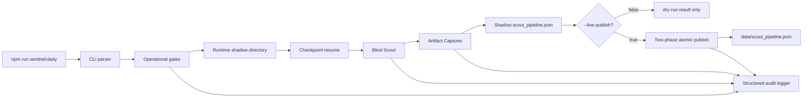

# Project Sentinel v3 Production Runtime Orchestrator SDD

Date: 2026-06-16
Status: Draft for red-line specification review
Owner: TZ
Baseline commit: `c306f50`
Parent SDD:
- `/Users/tristanzh/agent/docs/superpowers/specs/2026-06-14-project-sentinel-v3-design.md`
- `/Users/tristanzh/agent/docs/superpowers/specs/2026-06-16-project-sentinel-v3-capturer-design.md`
- `/Users/tristanzh/agent/docs/superpowers/specs/2026-06-15-project-sentinel-v3-e2e-live-fire-sdd.md`
Implementation root: `/Users/tristanzh/agent/Git-Scout`

## 1. Objective

Production Runtime Orchestrator is the Stage 6 module that turns Project Sentinel v3 from tested components into a controlled daily local runtime.

The orchestrator owns the daily execution boundary:

```text
CLI -> Runtime Gates -> Runtime Shadow -> Blind Scout -> Capturer -> Checkpoint -> Atomic Publish -> Agent07
```

It must make daily operation safe by default, resumable after interruption, observable when failures happen, and incapable of corrupting the Agent07 production truth source.

## 2. Non-Goals

- Do not replace the existing unit or E2E test runner.
- Do not make live network, live model, or live publish the default path.
- Do not mutate `/Users/tristanzh/agent/Git-Scout/data/scout_pipeline.json` during pipeline execution.
- Do not write runtime artifacts into `/Users/tristanzh/agent/Git-Scout/storage/e2e_sandbox/`.
- Do not read production runtime inputs from `/Users/tristanzh/agent/Git-Scout/tests/fixtures/`.
- Do not introduce Redis, SQLite, cron daemons, launchd agents, or cloud queues in this stage.
- Do not implement real model credentials or provider-specific API code in the orchestrator itself.

## 3. Runtime Placement

The orchestrator composes existing Sentinel modules through explicit adapters. It does not hide live side effects behind defaults.



## 4. CLI Command and Explicit Operational Gates

### 4.1 Package Command

`package.json` must expose:

```json
{
  "scripts": {
    "sentinel:daily": "tsx src/sentinel/runtimeOrchestratorCli.ts"
  }
}
```

If `tsx` is not already installed in the implementation phase, either add it as a dev dependency or use a repo-local compiled Node entry. The SDD requirement is the user-facing command, not a specific runner dependency.

### 4.2 CLI Flags

The command accepts these flags:

```text
npm run sentinel:daily -- [options]

Options:
  --dry-run              Force non-publishing dry-run mode. Default: true.
  --live-network         Permit real public network source adapters. Default: false.
  --live-model           Permit real LLM/model clients. Default: false.
  --live-publish         Permit atomic publish to data/scout_pipeline.json. Default: false.
  --date YYYY-MM-DD      Runtime business date. Default: local current date.
  --run-id ID            Override generated run id for tests. Must start with runtime_.
  --resume               Resume today's checkpoint if present. Default: true.
  --no-resume            Start a fresh shadow run and archive previous incomplete run.
  --max-candidates N     Upper bound before Top-5 filtering. Default: 20.
```

### 4.3 Gate Semantics

Default invocation:

```bash
npm run sentinel:daily
```

must be equivalent to:

```bash
npm run sentinel:daily -- --dry-run --date <today>
```

Default behavior:

| Gate | Default | Effect when false |
| --- | --- | --- |
| `live_network` | `false` | Use fixture/mock source adapter or cached local source snapshot. Throw `LIVE_NETWORK_DISABLED` if a live source adapter is requested. |
| `live_model` | `false` | Use local mock/fixture model adapter. Throw `LIVE_MODEL_DISABLED` before any real model client is invoked. |
| `live_publish` | `false` | Do not touch production `data/scout_pipeline.json`; write shadow result and dry-run summary only. |
| `dry_run` | `true` | Forces `live_publish = false`, even if the publish flag is mistakenly present. |

### 4.4 Forbidden Combinations

The parser must reject:

```text
--dry-run --live-publish
```

with:

```text
RUNTIME_GATE_CONFLICT
```

The parser must also reject live model without live network unless a future SDD adds a local source snapshot mode that explicitly supports that combination:

```text
--live-model --live-network=false
```

with:

```text
LIVE_MODEL_REQUIRES_EXPLICIT_SOURCE_MODE
```

### 4.5 Runtime Config Contract

The CLI must produce a single immutable runtime config object:

```ts
type RuntimeMode = "DRY_RUN" | "LIVE_COLLECT" | "LIVE_PUBLISH";

type RuntimeConfig = {
  version: 1;
  mode: RuntimeMode;
  date: string;
  run_id: string;
  gates: {
    dry_run: boolean;
    live_network: boolean;
    live_model: boolean;
    live_publish: boolean;
  };
  paths: {
    project_root: string;
    runtime_shadow_root: string;
    run_shadow_dir: string;
    production_pipeline_path: string;
    logs_dir: string;
  };
  limits: {
    max_candidates: number;
    max_selected_leads: 5;
    max_single_payload_tokens: number;
    max_daily_tokens: number;
  };
};
```

All downstream adapters receive this config or a narrowed read-only view of it. No downstream module may infer production paths from process cwd.

## 5. Runtime Shadow Directory Lifecycle

The orchestrator owns:

```text
/Users/tristanzh/agent/Git-Scout/storage/runtime_shadow/
```

Required layout:

```text
storage/runtime_shadow/
  runtime_20260616T073000Z/
    runtime_config.json
    checkpoint.json
    scout_pipeline.shadow.json
    artifacts/
    reports/
    logs/
    publish_manifest.json
    runtime_result.json
```

Rules:

- Every runtime run id must start with `runtime_`.
- Shadow files must be written with temp-file plus atomic rename.
- Shadow artifacts must never be written under `storage/artifacts/` until publish succeeds.
- Failed or interrupted runs remain inspectable and resumable.
- Successful dry-runs remain under `runtime_shadow/` and are never published.
- Successful live-publish runs may be retained for audit, then later pruned by a separate retention policy.

## 6. Two-Phase Atomic Publish Protocol

Production publish has two phases:

```text
Phase A: Build complete candidate state inside runtime_shadow/<run_id>
Phase B: Atomically merge validated shadow outputs into production paths
```

### 6.1 Phase A: Shadow Build

The orchestrator runs all expensive or failure-prone work in shadow:

- source collection
- Blind Scout filtering
- token pre-flight estimates
- artifact capture
- checkpoint updates
- report generation if the current runtime stage requires it

The production dashboard path is read-only during Phase A:

```text
/Users/tristanzh/agent/Git-Scout/data/scout_pipeline.json
```

### 6.2 Publish Manifest

Before Phase B, the orchestrator writes:

```json
{
  "version": 1,
  "run_id": "runtime_20260616T073000Z",
  "date": "2026-06-16",
  "status": "READY_TO_PUBLISH",
  "shadow_pipeline": "storage/runtime_shadow/runtime_20260616T073000Z/scout_pipeline.shadow.json",
  "target_pipeline": "data/scout_pipeline.json",
  "artifact_moves": [
    {
      "from": "storage/runtime_shadow/runtime_20260616T073000Z/artifacts/github_owner_repo",
      "to": "storage/artifacts/github_owner_repo"
    }
  ],
  "checks": [
    "schema_valid",
    "top5_count_valid",
    "all_thumb_paths_resolvable",
    "checkpoint_completed",
    "publish_gate_enabled"
  ],
  "created_at": "2026-06-16T07:30:00.000+08:00"
}
```

### 6.3 Phase B: Atomic Merge

Publish requires `--live-publish` and `dry_run = false`.

Steps:

1. Acquire production lock:

```text
data/scout_pipeline.json.lock/
```

2. Validate `publish_manifest.json`.
3. Copy or rename shadow artifact directories into production artifact temp directories:

```text
storage/artifacts/.runtime_20260616T073000Z.github_owner_repo.tmp/
```

4. Atomically rename artifact temp directories into final artifact directories where possible. If directory rename cannot be atomic across filesystems, the implementation must prove source and target are under the same `Git-Scout/storage/` root before allowing the operation.
5. Rewrite `artifacts.local_thumb_path` in the shadow pipeline from shadow paths to production served paths.
6. Write `data/scout_pipeline.json.<pid>.<uuid>.tmp`.
7. `fsync` temp file.
8. `fs.rename` temp file to `data/scout_pipeline.json`.
9. `fsync` parent directory.
10. Remove lock.
11. Write `runtime_result.json` with `status = "PUBLISHED"`.

If any step fails before step 8, production `data/scout_pipeline.json` remains untouched. If failure occurs after artifact directories moved but before pipeline publish, the next resume must detect orphaned production artifact directories by `run_id` and either reuse them or clean them before retry.

## 7. Checkpoint Resume State Machine

### 7.1 Checkpoint Contract

`checkpoint.json` lives inside the run shadow directory:

```json
{
  "version": 1,
  "run_id": "runtime_20260616T073000Z",
  "date": "2026-06-16",
  "status": "RUNNING",
  "created_at": "2026-06-16T07:30:00.000+08:00",
  "updated_at": "2026-06-16T07:31:22.140+08:00",
  "gates": {
    "dry_run": true,
    "live_network": false,
    "live_model": false,
    "live_publish": false
  },
  "token_ledger": {
    "estimated_input_tokens": 4271,
    "estimated_output_tokens": 0,
    "real_model_calls": 0,
    "fixture_model_calls": 4
  },
  "steps": [
    {
      "step_id": "source_collect",
      "status": "STEP_SUCCESS",
      "started_at": "2026-06-16T07:30:00.020+08:00",
      "completed_at": "2026-06-16T07:30:01.114+08:00",
      "attempts": 1
    },
    {
      "step_id": "capture:github_owner_repo",
      "repo": "github/owner/repo",
      "status": "STEP_SUCCESS",
      "started_at": "2026-06-16T07:30:10.011+08:00",
      "completed_at": "2026-06-16T07:30:12.883+08:00",
      "attempts": 1,
      "idempotency_key": "sha256(repo + artifact_urls + run_date)"
    }
  ]
}
```

Allowed checkpoint status:

```text
PENDING
RUNNING
PAUSED
FAILED
READY_TO_PUBLISH
PUBLISHED
DRY_RUN_COMPLETED
```

Allowed step status:

```text
STEP_PENDING
STEP_RUNNING
STEP_RETRYING
STEP_SUCCESS
STEP_FAILED_RETRYABLE
STEP_FAILED_TERMINAL
STEP_SKIPPED_RESUME
```

### 7.2 Resume Algorithm

At startup:

1. Compute runtime date.
2. Find latest `storage/runtime_shadow/runtime_<date>*` checkpoint.
3. If `--no-resume`, archive incomplete checkpoint to:

```text
storage/runtime_shadow/_archived/<run_id>/
```

4. If resume is enabled and checkpoint status is `RUNNING`, `PAUSED`, or `FAILED`, load it.
5. Verify gate compatibility. A run created with `live_model = false` cannot resume with `live_model = true`; a live run cannot be resumed as dry-run.
6. Skip every `STEP_SUCCESS` step.
7. For each `STEP_RUNNING` step from a previous process, mark it `STEP_FAILED_RETRYABLE` before retry.
8. For each repo-level capture step with `STEP_SUCCESS`, reuse its shadow artifact output and do not recapture or spend tokens.
9. Continue from the first incomplete required step.

### 7.3 Duplicate Token Spend Defense

Before any model call, even fixture model calls, the orchestrator must:

1. Check whether the target step has `STEP_SUCCESS`.
2. Check whether `idempotency_key` already exists in checkpoint.
3. Run pre-flight token estimation.
4. Increment `token_ledger` only after the call is permitted.
5. Write checkpoint immediately after successful model response.

If the process is killed after model response but before checkpoint write, retry may call the model again. To reduce this window, the implementation must write a `STEP_RUNNING` record with `model_call_started_at` before invocation and emit a warning on resume:

```text
POSSIBLE_DUPLICATE_MODEL_WINDOW
```

## 8. Structured Audit Logging

### 8.1 Log Location

Runtime logs live under:

```text
/Users/tristanzh/agent/Git-Scout/storage/logs/
```

Daily file:

```text
storage/logs/sentinel_daily_2026-06-16.log
```

The format is newline-delimited JSON. No unstructured `console.log` output is allowed in orchestrator execution paths except CLI final summary.

### 8.2 Log Event Contract

```ts
type RuntimeLogEvent = {
  ts: string;
  level: "DEBUG" | "INFO" | "WARN" | "ERROR";
  run_id: string;
  date: string;
  component:
    | "runtime"
    | "cli"
    | "blind_scout"
    | "capturer"
    | "auditor"
    | "publisher"
    | "checkpoint"
    | "token_gate";
  event: string;
  context: Record<string, unknown>;
};
```

Example:

```json
{"ts":"2026-06-16T07:30:11.218+08:00","level":"WARN","run_id":"runtime_20260616T073000Z","date":"2026-06-16","component":"blind_scout","event":"HTTP_429_BACKOFF","context":{"attempt":2,"delay_ms":2000,"source":"github_trending"}}
```

### 8.3 Required Events

The orchestrator must log:

| Event | Level | Required context |
| --- | --- | --- |
| `RUNTIME_STARTED` | `INFO` | gates, run_id, date |
| `RUNTIME_GATE_DISABLED` | `INFO` | gate name, fallback adapter |
| `LIVE_NETWORK_FORBIDDEN` | `ERROR` | attempted url, adapter |
| `TOKEN_PREFLIGHT_BLOCKED` | `WARN` | estimated tokens, threshold, step id |
| `HTTP_429_BACKOFF` | `WARN` | attempt, delay_ms, source |
| `CHECKPOINT_STEP_SUCCESS` | `INFO` | step_id, repo, duration_ms |
| `CHECKPOINT_RESUME` | `INFO` | previous status, skipped step count |
| `ATOMIC_WRITE_BEGIN` | `DEBUG` | target path, temp path |
| `ATOMIC_WRITE_COMMIT` | `DEBUG` | target path |
| `PUBLISH_READY` | `INFO` | manifest path, selected count |
| `PUBLISH_COMMIT` | `INFO` | target pipeline path |
| `PUBLISH_ABORTED` | `ERROR` | reason, failed step |
| `ARTIFACT_PURGE` | `INFO` | repo, path |
| `RUNTIME_COMPLETED` | `INFO` | status, duration_ms |

### 8.4 Rolling Strategy

For Stage 6:

- One log file per local date.
- Append-only writes.
- If file exceeds 25 MB, rotate to:

```text
sentinel_daily_2026-06-16.1.log
sentinel_daily_2026-06-16.2.log
```

- Keep the latest 7 local dates by default.
- Log pruning is a separate step after runtime completion and must never run during atomic publish.

## 9. Production and E2E Isolation Matrix

| Boundary | E2E Live-Fire | Production Runtime |
| --- | --- | --- |
| Input repo source | `tests/fixtures/repositories/` | live adapters only when `--live-network`; otherwise cached/mock source snapshot |
| Run root | `storage/e2e_sandbox/<run_id>/` | `storage/runtime_shadow/<run_id>/` |
| Production dashboard JSON | read-only / forbidden | writable only in Phase B with `--live-publish` |
| Artifact output | `storage/e2e_sandbox/<run_id>/artifacts/` | shadow first, then `storage/artifacts/` only during publish |
| Report output | `storage/e2e_sandbox/<run_id>/reports/` | `storage/runtime_shadow/<run_id>/reports/`, later publishable if needed |
| Model client | fixture model only | mock by default; real model only with `--live-model` |
| Network | fixture protocol only | disabled by default; live only with `--live-network` |
| Run label | `[FIXTURE_RUN]` | `[RUNTIME_DRY_RUN]` or `[RUNTIME_LIVE]` |
| Test dependency | deterministic test suite | manual or scheduled local command |

Hard rule:

```text
Production runtime code must never import from tests/fixtures.
E2E code must never write to data/scout_pipeline.json.
```

## 10. Runtime Result Contract

Each run writes:

```json
{
  "version": 1,
  "run_id": "runtime_20260616T073000Z",
  "date": "2026-06-16",
  "status": "DRY_RUN_COMPLETED",
  "mode": "DRY_RUN",
  "started_at": "2026-06-16T07:30:00.000+08:00",
  "completed_at": "2026-06-16T07:31:10.000+08:00",
  "checkpoint_path": "storage/runtime_shadow/runtime_20260616T073000Z/checkpoint.json",
  "shadow_pipeline_path": "storage/runtime_shadow/runtime_20260616T073000Z/scout_pipeline.shadow.json",
  "published_pipeline_path": null,
  "selected_count": 5,
  "token_ledger": {
    "estimated_input_tokens": 8120,
    "estimated_output_tokens": 0,
    "real_model_calls": 0,
    "fixture_model_calls": 5
  },
  "gates": {
    "dry_run": true,
    "live_network": false,
    "live_model": false,
    "live_publish": false
  },
  "warnings": []
}
```

Allowed runtime result status:

```text
DRY_RUN_COMPLETED
PUBLISHED
FAILED_RECOVERABLE
FAILED_TERMINAL
BLOCKED_BY_GATE
BLOCKED_BY_TOKEN_BUDGET
```

## 11. Failure Semantics

### 11.1 Recoverable Failures

These write checkpoint status `FAILED` and preserve shadow state:

- HTTP 429 after max retry attempts
- remote source timeout
- capturer timeout for a subset of artifacts
- model response parse failure in mock mode
- publish manifest validation failure before production lock

### 11.2 Terminal Failures

These abort immediately:

- path escape outside runtime shadow or production roots
- `--dry-run --live-publish`
- live model client requested with `live_model = false`
- live network request attempted with `live_network = false`
- production publish attempted without valid `publish_manifest.json`
- checkpoint schema invalid

### 11.3 Publish Failure Recovery

If failure happens during Phase B:

- Keep the production lock only for the active critical section.
- Log `PUBLISH_ABORTED`.
- Write `runtime_result.json` with `FAILED_RECOVERABLE` when production pipeline remains untouched.
- If production artifacts were moved but pipeline was not published, write `publish_recovery.json` describing orphaned artifact paths.
- Next resume must inspect `publish_recovery.json` before attempting another publish.

## 12. TDD Matrix for Next Phase

The next implementation phase must create Red tests before runtime implementation.

| Test | Setup | Required assertion |
| --- | --- | --- |
| Default command is dry-run | Parse no flags | `dry_run = true`, all live gates false, no production publish |
| Gate conflict blocks publish | Parse `--dry-run --live-publish` | Throws `RUNTIME_GATE_CONFLICT` |
| Live network disabled | Runtime uses live source adapter without `--live-network` | Throws/logs `LIVE_NETWORK_DISABLED` before any fetch |
| Live model disabled | Runtime attempts real model without `--live-model` | Throws/logs `LIVE_MODEL_DISABLED`; real model call count is 0 |
| Shadow-only execution | Dry-run completes | Writes only under `storage/runtime_shadow/<run_id>/`; production JSON unchanged |
| Two-phase publish | `--live-publish` and valid shadow manifest | Production `data/scout_pipeline.json` is replaced atomically after validation |
| Publish crash before rename | Inject error before final rename | Existing production JSON remains parseable and unchanged |
| Resume skips successful steps | Existing checkpoint has successful repo capture | Capture adapter is not called for that repo |
| Resume marks stale running step retryable | Existing checkpoint has `STEP_RUNNING` from dead process | Step becomes `STEP_FAILED_RETRYABLE` before retry |
| Token duplicate defense | Checkpoint has completed model idempotency key | Model adapter is not called again |
| Structured logs | Runtime hits token block and 429 retry | NDJSON log contains required events and context |
| E2E isolation | Runtime imports or reads from `tests/fixtures` | Test fails with boundary violation |

## 13. Proposed Implementation Files

```text
/Users/tristanzh/agent/Git-Scout/src/sentinel/runtimeOrchestrator.ts
/Users/tristanzh/agent/Git-Scout/src/sentinel/runtimeOrchestratorCli.ts
/Users/tristanzh/agent/Git-Scout/src/sentinel/runtimeConfig.ts
/Users/tristanzh/agent/Git-Scout/src/sentinel/runtimeCheckpoint.ts
/Users/tristanzh/agent/Git-Scout/src/sentinel/runtimeLogger.ts
/Users/tristanzh/agent/Git-Scout/src/sentinel/runtimePublisher.ts
/Users/tristanzh/agent/Git-Scout/tests/sentinel/runtimeOrchestrator.test.ts
/Users/tristanzh/agent/Git-Scout/tests/sentinel/runtimeConfig.test.ts
/Users/tristanzh/agent/Git-Scout/tests/sentinel/runtimeCheckpoint.test.ts
/Users/tristanzh/agent/Git-Scout/tests/sentinel/runtimePublisher.test.ts
/Users/tristanzh/agent/Git-Scout/tests/sentinel/runtimeLogger.test.ts
```

File responsibilities:

- `runtimeConfig.ts`: CLI argument parsing, gate validation, immutable config construction.
- `runtimeCheckpoint.ts`: checkpoint schema, atomic checkpoint writes, resume algorithm.
- `runtimeLogger.ts`: NDJSON logging, rotation, required event helpers.
- `runtimePublisher.ts`: publish manifest validation and two-phase atomic publish.
- `runtimeOrchestrator.ts`: high-level daily flow composition.
- `runtimeOrchestratorCli.ts`: thin CLI wrapper only; no business logic.

## 14. Approval Gate

This SDD authorizes design review only.

The next phase must be an implementation plan followed by TDD Red tests. No runtime business implementation should be written until the implementation plan and Red tests have been reviewed.
